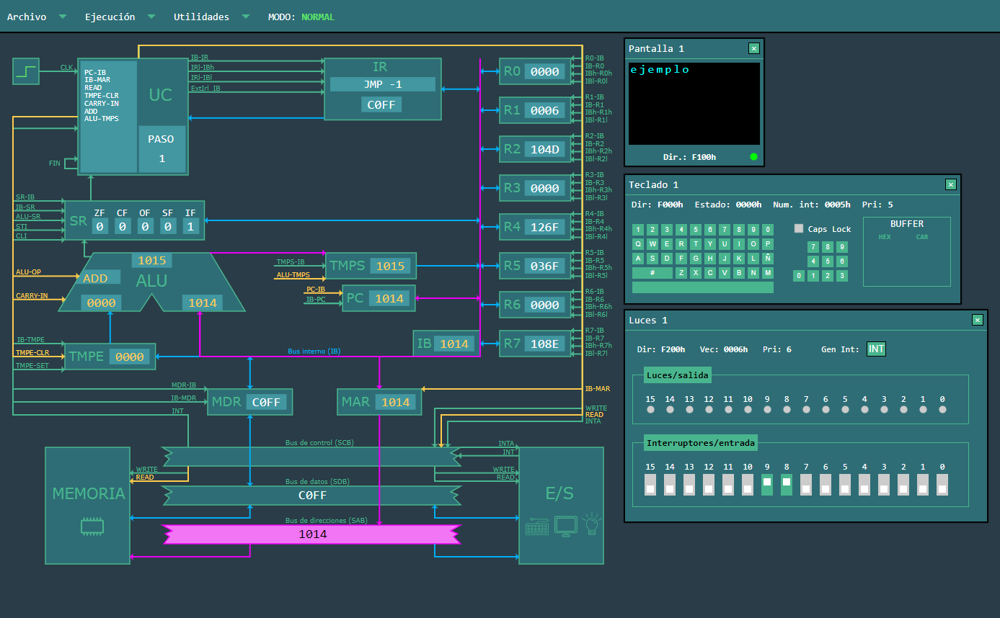

# SimCT

## Introducción

SimCT es un simulador web del Computador Teórico (CT) usado en la Uniersidad de
Oviedo (UniOvi). El computador fue creado por profesores del [Área de
Arquitectura de Computadores (ATC)](https://www.atc.uniovi.es/) de la
universidad. La versión inicial del simulador web ha sido desarrollada como 
Trabajo Fin de Máster.

El simulador ofrece la posibilidad de configurar la memoria y los dispositivos
periféricos del CT, así como cargar y ejecutar programas. Además, permite
visualizar el funcionamiento interno del computador mientras se ejecutan las
instrucciones, ya sea de forma continua o instrucción por instrucción. También
se brinda la opción de realizar una ejecución paso a paso de cada ciclo de una
instrucción.

El simulador tiene también un modo manual en el que se puede seleccionar un
conjunto de señales que se desea ejecutar.

La siguiente imagen muestra un ejemplo de funcionamiento del simulador:

Para saber más sobre el Computador Teórico, se puede consultar el libro
[Computadores y Redes](https://www.atc.uniovi.es/libros/computadores_redes/).

## Ejecución

El simulador está desarrollado íntegramente en JavaScript como una aplicación
cliente, sin necesidad de un servidor. Se puede acceder a una versión ejecutable alojada en
GitHub en [esta dirección](http://example.com).

Además, se puede descargar [este archivo](http://example.com) y ejecutarlo
localmente.

## Desarrollo

El simulador está publicado como software libre con licencia MIT. 

La evolución del software será continuada en [este repositorio](https://github.com/asi-uniovi/simct)

